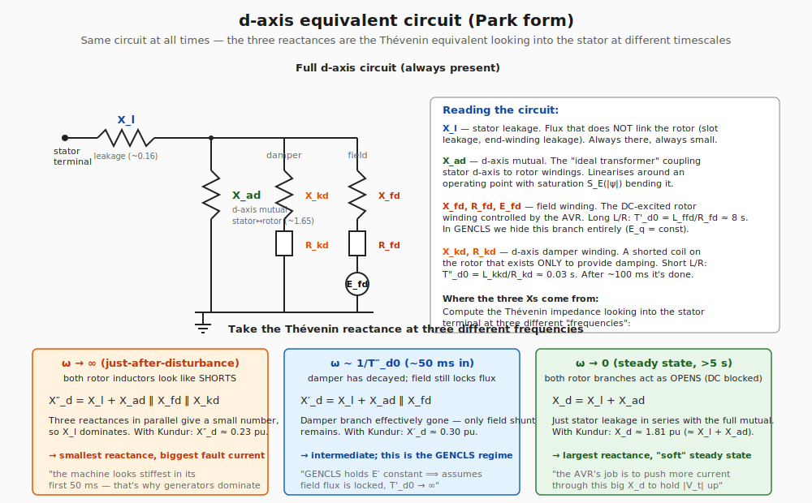
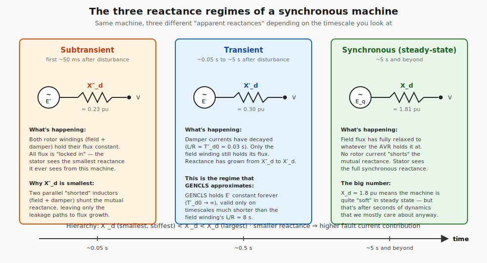

# GENROU — physical foundations

This document explains what every parameter in the GENROU model
*physically represents*, before we ever look at the differential
equations. Read this first; the math in `smib/models/genrou.py` falls
out cleanly once you know what each symbol means.

The smib Phase 1 code already implements the simplest possible
synchronous machine (GENCLS — constant E' behind X'_d). GENROU is a
strict superset: same rotor and same swing equation, but with the
rotor flux dynamics no longer assumed to be infinitely slow.

## 1. The machine itself

A round-rotor synchronous machine has three magnetically coupled
sets of windings:

- **Stator (3-phase)** — produces the rotating magnetic field that
  appears in the network.
- **Rotor field winding** — DC-excited, on the d-axis (aligned with
  the rotor poles). The voltage across this winding, $E_{fd}$, is
  what the AVR controls. Its terminal is brought out through slip
  rings or a brushless exciter.
- **Rotor damper windings (amortisseur)** — short-circuited coils
  built into the rotor pole face that exist solely to dissipate
  oscillation energy. There is one on the d-axis ("kd") and at
  least one on the q-axis ("kq"). They have **no external terminals**
  — they're just shorted loops.

When you transform stator quantities into the rotor reference frame
via Park's transformation, the d-axis and q-axis can be analysed
independently. Each axis has its own equivalent circuit.

## 2. The d-axis equivalent circuit

The diagram above shows the **same circuit at all times**. What
changes is which branches are "shorted by their flux" and which have
"let go". The three reactances $X_d$, $X'_d$, $X''_d$ are just
**Thévenin equivalents** looking into the stator terminal at three
different timescales.

### Why $X''_d < X'_d < X_d$

A coil with finite L and finite R holds its flux for a time $L/R$
after a disturbance. While it's holding flux, it acts like a
short-circuit to *new* flux (an inductor at $\omega \to \infty$);
once its $L/R$ has passed, it acts like an open circuit (an inductor
at $\omega \to 0$).

So:

- **$\omega \to \infty$** (just-after disturbance, sub-transient):
  both the field branch and the damper branch are still "locked" by
  their flux linkages, and act as short circuits across the mutual
  reactance $X_{ad}$. The Thévenin reactance reduces to
  $X''_d = X_l + X_{ad} \| X_{fd} \| X_{kd}$. With three reactances
  in parallel, the parallel combination is small, so $X_l$ dominates.
  Result: **smallest** Thévenin reactance.

- **$\omega \sim 1/T''_{d0}$** (after the damper has decayed, ~50 ms
  in, transient): the damper branch is "gone" (its current has
  dissipated), but the field winding still holds its flux. Thévenin
  becomes $X'_d = X_l + X_{ad} \| X_{fd}$. Two parallel branches
  give a slightly larger result. Intermediate.

- **$\omega \to 0$** (long after both decay, steady state): both
  rotor branches are open circuits to DC, so we just see the full
  $X_d = X_l + X_{ad}$. **Largest** reactance.

So the **hierarchy** is $X''_d < X'_d < X_d$, and it's set by which
rotor branches are still holding flux when the disturbance is
"observed".

### The physical meaning, in one line each

| Symbol | What it physically is |
|---|---|
| $X_l$ | Stator leakage reactance — flux that doesn't link the rotor (slot leakage, end-winding leakage). Always present. |
| $X_{ad}$ | d-axis stator-rotor mutual reactance — the "ideal transformer" coupling. Saturates at high flux. |
| $X_d$ | Total d-axis steady-state reactance: $X_l + X_{ad}$. The biggest reactance, seen long after disturbances settle. |
| $X'_d$ | d-axis transient reactance: with the field winding holding its flux, only $X_l$ + $X_{ad} \| X_{fd}$ remain. Intermediate. |
| $X''_d$ | d-axis sub-transient reactance: with both field AND damper holding flux. Smallest. |

## 3. The three regimes over time

This is the same picture as the equivalent circuit above, but plotted
against time after a disturbance. The time axis is logarithmic:
$X''_d$ applies for tens of milliseconds, $X'_d$ for hundreds of
milliseconds to a few seconds, and $X_d$ for everything beyond.

The hierarchy $X''_d < X'_d < X_d$ has a direct operational
consequence: the **machine's effective impedance is smallest at the
moment of a disturbance** and grows over time. That's why
synchronous generators are the dominant short-circuit current source
on a transmission network — for the first 50 ms of any fault, every
machine on the system is acting like a low-impedance current source
behind $X''_d$.

## 4. The d-axis time constants $T'_{d0}$ and $T''_{d0}$

These are exactly what they look like — the L/R time constants of
the rotor windings, evaluated **with the stator open-circuited**:

$$ T'_{d0} = \dfrac{L_{ffd}}{R_{fd}} \approx 5{-}10 \text{ s} $$

$$ T''_{d0} = \dfrac{L_{kkd}}{R_{kd}} \approx 0.02{-}0.1 \text{ s} $$

The "0" subscript means open-circuit. Loaded ("closed-circuit") time
constants $T'_d$ and $T''_d$ are slightly smaller because the stator
also drains some flux — but the open-circuit numbers are what PSSE
takes as input and what define the model.

**Why the field is so much slower than the damper:**

- The field winding is wound from many turns of large-cross-section
  copper, sized for high inductance and low resistance — it is
  designed to be a near-perfect inductor over the relevant
  timescales. Result: $T'_{d0}$ measured in seconds.
- The damper winding is a few thick rotor-pole bars, designed for
  low impedance to brief transients. Smaller $L$, similar $R$.
  Result: $T''_{d0}$ measured in tens of milliseconds.

The ratio matters for stability: $T'_{d0} \gg T''_{d0}$ means there
is always a clean separation between the two time scales, which lets
us treat them as separate states in GENROU rather than as a coupled
4-pole transfer function.

## 5. The q-axis (round rotor)

For a **round-rotor** machine like GENROU, the q-axis has **two
damper windings** but no field winding. So the q-axis equivalent
circuit looks identical to the d-axis circuit in section 2 except:

- Replace $X_{ad}$ with $X_{aq}$ (q-axis mutual).
- The "field" branch is now another damper (no $E_{fd}$ source —
  shorted, like the kd damper).
- We have two damper branches with two different time constants:
  $T'_{q0}$ (slower, ~1 s) and $T''_{q0}$ (faster, ~0.07 s).

Same hierarchy: $X''_q < X'_q < X_q$.

For a **salient-pole** machine (GENSAL), the q-axis has only one
damper winding (no transient regime) and $X'_q = X_q$. We are not
modelling salient pole here.

## 6. Saturation $S_E(|\psi|)$

The iron core of the machine saturates at high flux density. Below
the knee point, the relationship between MMF (current × turns) and
flux is roughly linear (everything in the equivalent circuit above is
*linear*). Above the knee, you need disproportionately more MMF for
a given increment of flux.

PSSE models this with a quadratic correction:

$$ S_E(|\psi|) = B (|\psi| - A)^2 \qquad \text{for } |\psi| > A $$

with $A$ and $B$ fit from two reference points: $S_{1.0}$ at 1.0 pu
air-gap flux and $S_{1.2}$ at 1.2 pu. For Kundur Table 4.2 values
($S_{1.0} = 0.13$, $S_{1.2} = 0.50$), this works out to $A \approx 0.79$
pu and $B \approx 3.0$.

Operationally, $S_E(|\psi|) \cdot E'_q$ appears as an additional MMF
demand on the field circuit — it makes the field winding work harder
to maintain a given $|E'_q|$ when the flux is high. This matters
during AVR ceiling hits in Phase 2.1.

## 7. Mechanical: $H$ and $D$

These are unchanged from GENCLS. $H$ is the inertia constant in
seconds (kinetic energy stored at synchronous speed, normalised by
the machine's MVA base). $D$ is mechanical damping in pu torque per
pu speed deviation.

$$ H = \dfrac{\tfrac{1}{2} J\,\omega_{m0}^{2}}{S_{\text{base}}} \quad [\text{s}] $$

A typical thermal machine has $H \approx 3{-}7$ s, hydro $H \approx 2{-}4$ s,
synchronous condensers $H \approx 1{-}3$ s. We use $H = 4$ s, the same
as in Phase 1, so we can compare GENCLS and GENROU directly.

## 8. The seven (or so) GENROU states

Combining everything: GENROU has **6 states total** —

| State | Type | What it represents |
|---|---|---|
| $\delta$ | mechanical | rotor angle relative to synchronous reference |
| $\bar\omega$ | mechanical | per-unit slip |
| $E'_q$ | electrical | d-axis transient EMF, $\propto$ field winding flux linkage $\psi_{fd}$ |
| $E'_d$ | electrical | q-axis transient EMF, $\propto$ slow q-axis damper flux linkage |
| $\psi''_d$ | electrical | d-axis sub-transient flux linkage (the fast d-axis damper) |
| $\psi''_q$ | electrical | q-axis sub-transient flux linkage (the fast q-axis damper) |

GENCLS keeps just $\delta$ and $\bar\omega$, freezes everything else.
GENROU lets all six evolve.

## 9. The Kundur Table 4.2 parameter set we use

| Parameter | Value | Notes |
|---|---|---|
| $X_d$ | 1.81 pu | d-axis synchronous |
| $X_q$ | 1.76 pu | q-axis synchronous (almost = $X_d$ for round rotor) |
| $X'_d$ | 0.30 pu | d-axis transient — same as Phase 1's GENCLS |
| $X'_q$ | 0.65 pu | q-axis transient |
| $X''_d$ | 0.23 pu | d-axis sub-transient |
| $X''_q$ | 0.25 pu | q-axis sub-transient |
| $X_l$ | 0.16 pu | stator leakage |
| $T'_{d0}$ | 8.0 s | field winding L/R |
| $T''_{d0}$ | 0.03 s | d-axis damper L/R |
| $T'_{q0}$ | 1.0 s | slow q-axis damper L/R |
| $T''_{q0}$ | 0.07 s | fast q-axis damper L/R |
| $H$ | 4.0 s | inertia (matches GENCLS) |
| $D$ | 0 | no mechanical damping |
| $S_{1.0}$ | 0.13 | saturation at 1.0 pu flux |
| $S_{1.2}$ | 0.50 | saturation at 1.2 pu flux |

These are standard "thermal unit on infinite bus" parameters used in
every transient stability text. We keep them fixed across Phase 2.0
through Phase 2.3 so the only thing that changes between sub-phases
is which controller is added on top.

## 10. How the GENCLS limit emerges

GENCLS is the limit of GENROU obtained by:

1. $X_d = X'_d = X''_d$ (no rotor flux dynamics — the same reactance
   at all timescales).
2. $T'_{d0} \to \infty$ (field flux locked forever).
3. $T''_{d0} \to 0$ (damper instantly equilibrates, no sub-transient
   regime to speak of).
4. No q-axis dynamics: $X_q = X'_q = X''_q = X'_d$, $T'_{q0}, T''_{q0}$
   irrelevant.
5. No saturation: $S_{1.0} = S_{1.2} = 0$.

Under these limits, the four GENROU electrical equations collapse to
"$E'_q$ stays constant" and the swing equation is unchanged. We use
this as a **regression test**: a GENROU initialised with these limit
values must produce a flat-line response identical to GENCLS at the
same operating point.

---

**Next steps in the smib repo:**

- `smib/models/genrou.py` — the implementation, with this document
  in mind.
- `notebooks/phase2_0_genrou.ipynb` — the colleague-facing artefact
  applying the seven pedagogy rules to GENROU.
- `psse/phase2/` — PSSE benchmark equivalent.
