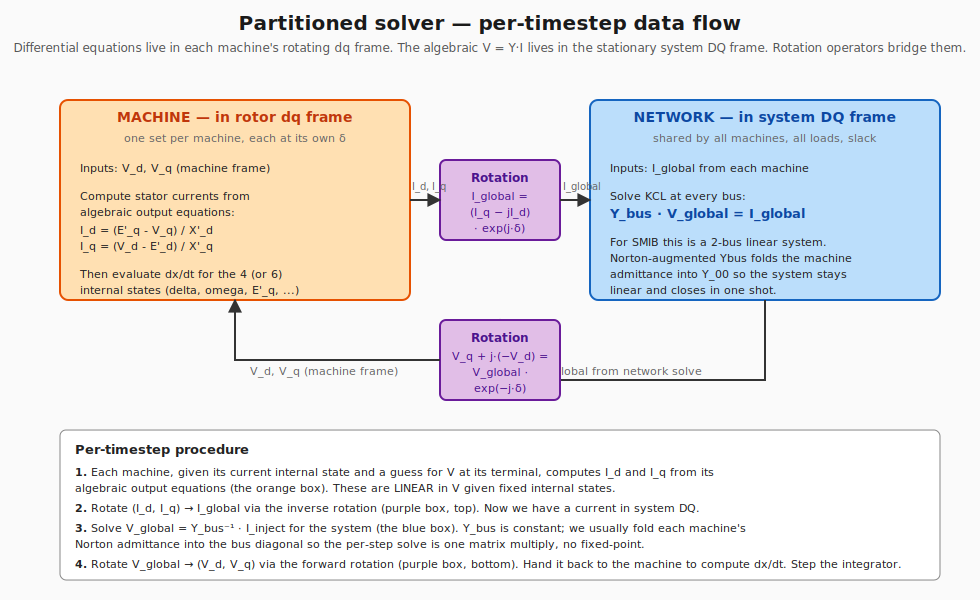

# The network–machine interface in RMS/phasor simulators

This document fills in a gap that the model-by-model docs leave open:
**how the per-machine differential equations talk to the algebraic
network solve at each integrator timestep**, and how the rotation
between the stationary system DQ frame and each machine's rotating
dq frame is set up.  This is the part of an RMS simulator that has
no direct analogue in EMT (where everything lives in abc time domain
and you just run Park's transformation continuously); in RMS/phasor
the partition between "differential" and "algebraic" is a *design
choice*, and how it's implemented determines the simulator's speed,
stability, and how PSSE/PowerWorld block diagrams map onto code.

## 1. Two reference frames

In an RMS/phasor simulator we have already "divided out" the 50 or
50 Hz carrier — every voltage and current is a phasor that's
**stationary in steady state**.  But "stationary" is relative to
*what*?  We need a reference.

- **System DQ frame** (capital D, Q).  Stationary, rotating with the
  *system synchronous reference* at $\omega_0 = 2\pi f_0$.  This is
  the frame the network lives in.  $Y_\text{bus}$ doesn't depend on
  rotor angles; admittances are fixed complex numbers in this frame.
  At steady state, all phasors here are constant.

- **Machine dq frame** (lowercase d, q), one per generator.
  Rotating with the *rotor* of that machine, at angle $\delta$ from
  the system reference.  Within this frame, the rotor's internal EMF
  $E_q$ lies on the q-axis by convention, the field winding sits on
  the d-axis, and the differential equations of the rotor flux
  states ($E'_q$, $E'_d$, $\psi''_d$, $\psi''_q$, …) take their
  natural form.  At steady state, $\delta$ is constant, so this
  frame is also stationary — just rotated by $\delta$ relative to
  the network frame.

The transformation is a single complex rotation:

$$ X_\text{machine,complex} = X_\text{global} \cdot e^{-j\delta} $$

where the result is decomposed as follows (Kundur convention, used
throughout smib):

$$ X_q = \mathrm{Re}(X_\text{global} \cdot e^{-j\delta}), \qquad X_d = -\mathrm{Im}(X_\text{global} \cdot e^{-j\delta}) $$

In code this is one line — see ``smib/models/genrou.py:_to_machine_dq``.

### Why two frames at all?

You might ask why the simulator can't just stay in one frame end-to-end
the way EMT does.  Two reasons:

1. **The network is universal — every machine sees the same Y_bus.**
   Each individual machine has its own $\delta$, so each rotor has a
   different rotation relative to the network.  Solving the algebraic
   network in the *common* DQ frame avoids having to re-rotate
   $Y_\text{bus}$ for every machine on every timestep.
2. **Machine equations are simplest in their own dq frame.**  $E'_q$
   on the q-axis, $E'_d$ on the d-axis, the swing equation referring
   to the rotor's own coordinates — all of this falls out cleanly.
   Rewriting GENROU in network DQ would couple all the model states
   to $\delta$ in messy, non-physical ways.

So the simulator alternates: machines integrate in their own dq, the
network is solved once per step in DQ, and a rotation operator
bridges them.  This is the **partitioned scheme** every RMS tool
uses (PSSE, PowerWorld, PSCAD-RMS, DigSILENT, smib).

### The other convention you'll see

PSSE and PowerWorld write phasors as $X_d + jX_q$ (d-axis on the real
part, q-axis on the imaginary).  Smib uses $X_q$ on real, $X_d$ on
$-$imag (Kundur convention).  These are **algebraically identical**
— you can move between them with a $\pi/2$ phase shift on the
rotation operator:

$$ \underbrace{X_\text{global} = (X_q - jX_d)\,e^{j\delta}}_{\text{Kundur (smib)}} \;\;\equiv\;\; \underbrace{X_\text{global} = (X_d + jX_q)\,e^{j(\delta-\pi/2)}}_{\text{PSSE / PowerWorld}} $$

Both encode the same physics — exporting generator at lagging PF
gives $I_q > 0$ (torque, parallel to $E_q$) and $I_d > 0$
(demagnetising, perpendicular to $E_q$).  When reading PSSE or
PowerWorld block diagrams against smib code, just remember to swap
the $d/q$ labels in your head if you need to compare directly.

## 2. The partitioned solver per timestep

The full per-timestep procedure has four logical phases:

1. **Each machine computes its own stator currents** $I_d$, $I_q$
   from its **algebraic output equations** given the current internal
   state and a current guess for the terminal voltage in machine dq.
   For our 4-state GENROU::

       I_d = (E'_q - V_q) / X'_d
       I_q = (V_d - E'_d) / X'_q

   These are *linear in V* given fixed internal states $(E'_q, E'_d, \delta)$
   — that linearity is what makes the network solve close in one shot
   instead of needing fixed-point iteration.

2. **Rotate to network frame.**  The machine's current
   $(I_d, I_q)$ is rotated to global DQ by the inverse transform:

   $$ I_\text{global} = (I_q - j I_d)\,e^{j\delta} $$

3. **Solve the algebraic network.**  Apply KCL at every bus:

   $$ Y_\text{bus} \cdot V_\text{global} = I_\text{inject} $$

   For SMIB this is a 2-bus linear system.  In smib we use the
   **Norton-augmented Ybus** trick: each machine's "internal
   admittance" (e.g. $1/(jX'_d)$ for GENCLS, the 2×2 saliency-aware
   admittance for GENROU) is folded into $Y_\text{bus}[0,0]$ ahead
   of time, so the per-step solve is one matrix multiply with no
   inner iteration.  See ``simulator.py:_solve_network_with_genrou``.

4. **Rotate back to machine frame.**  The freshly-solved
   $V_\text{global}$ at the machine bus is rotated forward via the
   forward transform:

   $$ V_q + j(-V_d) = V_\text{global} \cdot e^{-j\delta} $$

   and handed back to the machine, which now has consistent
   $(V_d, V_q)$ to feed into its differential-equation evaluation.

Then the integrator (implicit trapezoidal in smib) takes the
$dx/dt$ from each machine, advances all states by one step $h$, and
the loop repeats.

### Where Norton augmentation comes in

Step 3 needs $I_\text{inject}$, which depends on $V_\text{global}$,
which depends on $I_\text{inject}$.  That's a fixed point.  For a
linear machine model (GENCLS, our 4-state GENROU), the dependence is
linear, so we can substitute and solve in closed form — the trick is
to fold the machine's "internal admittance" into the network so the
fixed point disappears.

For GENCLS on SMIB::

    I_inject(V) = (E' - V) / (jX'_d) = E'/(jX'_d) - V/(jX'_d)
                = I_norton                - Y_norton · V

Substituting into the network::

    Y_00 · V + Y_01 · V_slack = I_norton - Y_norton · V
    (Y_00 + Y_norton) · V = I_norton - Y_01 · V_slack
    V = (I_norton - Y_01 · V_slack) / (Y_00 + Y_norton)

That's the one-line solve in ``simulator.py:_solve_network_with_gencls``.

For GENROU with saliency ($X'_d \ne X'_q$), the Norton equivalent is
a 2×2 admittance instead of a scalar, so we set up a 2×2 linear
system in the real and imaginary parts of $V$ and solve it with
``np.linalg.solve``.  See ``_solve_network_with_genrou`` for the
explicit derivation.

For non-linear models (full GENROU with sub-transient detail and
saturation, IBR controllers with hard limits) we'd need an inner
iteration on the algebraic loop — typically a few fixed-point
sweeps or a simultaneous Newton on the joint (DAE) system.  Smib's
4-state GENROU is linear-in-V so the closed-form solve still works.

## 3. Reading PowerWorld and PSSE block diagrams

The PowerWorld GENROU diagram (which Sameer shared, derived from
PSSE) follows this structure exactly.  Walking through it:

- The two **integrator blocks** $1/(T'_{d0}\,s)$ and $1/(T''_{d0}\,s)$
  on the d-axis evolve $E'_q$ and $\psi'_d$ (note: PowerWorld writes
  $\psi'_d$ for what some texts call $\psi''_d$ — it's the same
  thing).  Q-axis has the matching pair feeding $E'_d$ and $\psi'_q$.

- The **"Convert to Network Reference" box** in the top right is
  exactly our rotation step 2:

  $$ I_r + jI_i = (I_d + jI_q)\,e^{j(\delta - \pi/2)} $$

  This is PowerWorld's $(d, q)$ convention (d on real, q on imag) —
  so when comparing to smib code, swap the $d/q$ labels and the sign
  of the rotation works out the same:
  $(I_q - jI_d)\,e^{j\delta} = -j(I_d + jI_q)\,e^{j\delta} = (I_d + jI_q)\,e^{j(\delta - \pi/2)}$.

- The **"Norton equivalent" symbol bottom right** ($I_r + jI_i$ in
  parallel with $R_a + jX''_q$) is exactly the augmented-Ybus story —
  the machine's sub-transient impedance is what gets folded into
  $Y_\text{bus}$ on the network side.  The $\psi''_d$ and $\psi''_q$
  states feeding the input of that current source are what makes the
  Norton current source state-dependent (just like our
  $I_\text{norton} = E'/(jX'_d)$ depends on $E'_q$ via the $\delta$
  rotation).

- The note "**$X''_q = X''_d$ always**" in PowerWorld is the
  round-rotor sub-transient symmetry — they assume isotropic
  sub-transient saliency.  In our 4-state model we don't have $X''$
  at all, so this doesn't bite us; in the future Phase 2.0b
  upgrade to full GENROU we'd inherit this assumption.

- The **saturation block** ($\sqrt{x^2+y^2}$ feeding a curve, then
  divide by input) computes
  $S_E(|\psi_\text{ag}|) / |\psi_\text{ag}|$ — the per-unit
  saturation factor — and multiplies the air-gap flux components.
  In our 4-state model we approximate this by saturating only on
  $|E'_q|$, which is acceptable when saturation is mild (our
  operating point sits below the knee).

## 4. Where IBR models fit in

The same partitioned structure handles inverter models, but the
network interface is more interesting because:

- IBR converters have **current limits** that bind during faults,
  making $I_\text{inject}(V)$ non-linear in $V$.  The Norton-augmented
  Ybus trick still works *outside* the limit, but during saturated
  operation we need an inner iteration on the algebraic loop.

- Grid-following IBRs (REGC_A) measure the terminal voltage angle
  via a PLL and command currents in the *PLL frame* — which is yet
  another rotating frame, distinct from any machine's dq.  The
  rotation $\theta_\text{PLL}$ is itself a state of the IBR model,
  not an external input.

- Grid-forming IBRs (REGFM_B1 in PowerWorld terminology) impose a
  voltage rather than a current — they look more like a Thévenin
  source than a Norton source, which changes how they fold into
  $Y_\text{bus}$.

The full treatment of IBR network interfaces lands in **Phase 3**
of smib, after the sync-machine + AVR + PSS + Gov stack is shipped.
At that point we'll add a corresponding Phase 3 foundations
document covering REGC_A's $I_d$/$I_q$ command structure, REGFM's
voltage-source equivalence, and the PLL frame's relationship to the
network frame.

References to pre-read (these are the PowerWorld model docs the
user flagged):

- [GENROU machine model](https://www.powerworld.com/WebHelp/Default.htm#TransientModels_HTML/Machine%20Model%20GENROU.htm) — the diagram analysed in §3 above.
- [REGC_A grid-following IBR](https://www.powerworld.com/WebHelp/Content/TransientModels_HTML/Machine%20Model%20REGC_A.htm) — Phase 3 reference.
- [REGFM_B1 grid-forming IBR](https://www.powerworld.com/WebHelp/Content/TransientModels_HTML/Machine%20Model%20REGFM_B1.htm) — Phase 4 reference.

## 5. What's in the smib black-box right now (and what's not)

Confirming the boundaries explicitly:

**Implemented**:

- Stationary system DQ frame (network) and rotating machine dq frame
  (per machine), with the Kundur-convention rotation between them.
- Park's transformation from time-domain abc to dq is *implicit* — we
  never deal with abc signals.  Phasors are RMS quantities in the
  synchronous reference frame from the start.
- Per-machine rotation in ``smib/models/{gencls,genrou}.py``
  (``_to_machine_dq`` helpers and inverse rotation in
  ``current_injection``).
- Closed-form network solve for linear machine models (GENCLS Norton
  scalar; GENROU 2×2 saliency-aware solve in
  ``simulator._solve_network_with_genrou``).
- Implicit trapezoidal integrator with fixed-point corrector for the
  *differential* part (``solver.trapezoidal_step``).

**Approximations vs full PSSE / PowerWorld GENROU**:

- We model only the **transient** time scale, not sub-transient.  No
  $\psi''_d$, $\psi''_q$, $X''_d$, $X''_q$, or stator leakage $X_l$
  in the equations.  This costs ~30 % on first-cycle fault current
  magnitude, negligible beyond 50 ms.
- Saturation in our 4-state model acts on $|E'_q|$ alone.  Full
  GENROU saturates the air-gap flux $\sqrt{\psi_d^2 + \psi_q^2}$ and
  applies the factor to both axes.
- The omega-on-ψ term ($V = j(1+\omega)\psi$ in the PowerWorld
  diagram, accounting for speed-voltage coupling at off-nominal
  speed) is dropped — we use $V = j\psi$ at $\omega_0$ exactly.  At
  small slip ($\bar\omega < 0.05$ pu) the error is ~5 %.

**Not yet implemented** (Phase 2.1+):

- Multi-model algebraic loop closure when controllers (AVR, PSS,
  Governor) feed back into machine inputs.  Currently each timestep
  evaluates models in a fixed signal-flow order; a rigorous
  simultaneous Newton would resolve any controller-machine algebraic
  loops together.  In practice the fixed-flow ordering converges
  fine for our scenarios because the controller dynamics are slow
  relative to the integrator step.
- IBR models entirely (Phase 3 onward).
- Multi-machine networks (the partitioned structure handles this
  trivially — just iterate over machines in step 1 and step 4 — but
  we haven't written the code yet because SMIB is single-machine).
- Hard limits with anti-windup that break linearity in the network
  loop (would require inner iteration; relevant for IBR current
  limiting and AVR ceiling on long faults).

## 6. Pedagogical handle: when to use which frame

Quick mental model for working in this codebase:

| You're thinking about… | Which frame? |
|---|---|
| A bus's voltage as a phasor, $|V|\angle\theta_V$ | **Network DQ** (system synchronous reference). |
| Power flowing on a line, $S = V \cdot I^*$ | **Network DQ** (both V and I in DQ, complex multiply). |
| A generator's rotor angle $\delta$, EMF $E'_q$, slip $\bar\omega$ | **Machine dq** for the relevant machine. |
| The d-axis or q-axis current as a stator dq quantity | **Machine dq**. |
| The fault current contributed by a machine, in terms of the system | **Network DQ** — but it was COMPUTED in machine dq and rotated. |
| AVR sensing $|V_t|$ | The AVR sees the magnitude only — frame-invariant — so either. |
| PSS sensing rotor speed $\bar\omega$ | Frame-invariant (just a scalar). |

This is also why every dynamics plot you see in the smib notebooks
labels P, Q, |V|, $I_d$, $I_q$ — and why Iq/Id are in *machine dq*,
not network DQ.  When you compare smib's $I_d$ trace to PSSE's, both
should agree (modulo the d/q label swap explained in §1).

## 7. Reading order for the project

If you're a colleague picking this up cold, the recommended reading
order:

1. ``README.md`` (top of repo) — project overview and 8 pedagogy rules
2. ``docs/genrou_physical_foundations.md`` — what each parameter
   physically represents, equivalent circuits, time scales
3. **This document** (``docs/network_machine_interface.md``) — how
   the simulator stitches model dynamics to the network solve
4. ``notebooks/phase1_gencls.ipynb`` — Phase 1 walkthrough applying
   all eight rules to GENCLS
5. ``notebooks/phase2_0_genrou.ipynb`` — Phase 2.0 walkthrough,
   GENROU vs GENCLS overlay
6. ``smib/models/{gencls,genrou,st1a}.py`` — the actual
   implementations, cross-referenced against the foundations docs

The order is "physics → math → solver → code" so the equations make
sense before you see the code, and the code reads as a transcription
of the equations rather than as an artefact you have to
reverse-engineer.
